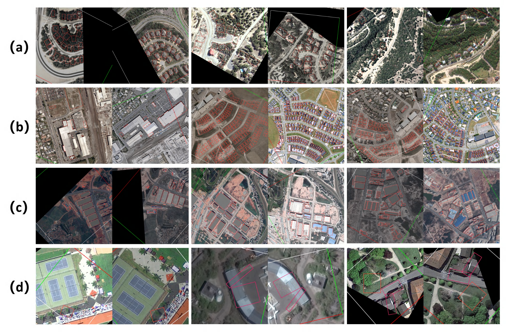

OBCD 1.0

OBCD-Net: OBject-Level Change Detection in Non-Aligned Remote Sensing Images
Zhe Xing, Jin Liu∗, Zhenfeng Shao, Biyin Zhang, Yaorong Cen, Miaozhong Xu

| |
| :---: |
|  |
| *图1.非对齐遥感影像变化检测* |

武汉大学  测绘遥感信息工程全国重点实验室  刘进课题组